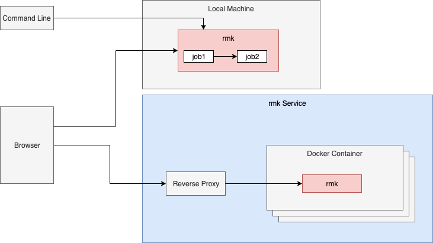

# rmk

rmk is a software construction tool with a mix of features of make, rake maven, Scons and gradle. Unlike these tools rmk follows the idea that translation rules are not configured but implemented like normal code. Make targets become simple method calls. All configuration parameters are passed explicitly.


## Features

* **Fast incremental builds**
* Build scripts are written in Ruby
* Support for Java projects
* Support for C++ projects
* Automatic dependency management for C and C++
* Support for maven dependencies
* Advanced project dependencies using normal Ruby method calls
* Support for parallel builds
* Extremely fast (Delta build with 10000 files without changes in less than 1 second)
* Share built files in a cache
* Cross-platform builds on Linux, Mac OS X and Windows


## Installation

```bash
sudo gem install rmk
```


## C++ Example


```ruby
plugin 'gnu' # Load gnu Toolchain

def compile_cpp()
  cc(glob("*.cpp"),[]) # Compile all cpp files in the current directory
end
```

You can run this build script with

```bash
rmk compile_cpp
```

## Java Example

```ruby
plugin 'java' # Load java support

def compile_java()
  # compile all files in src/main/java/**/*.java and include them in one jar file named test
  jar("test",javac(glob("src/main/java/**/*.java"),[]))
end
```

You can run this build script with

```bash
rmk compile_java
```

## Maven support

```ruby
plugin 'java'  # Load java support
plugin 'maven' # Load maven support

Maven.repository = "http://repo1.maven.org/maven2" # Configure maven repository

def compile_java()
  # compile all files in src/main/java/**/*.java with tapestry support
  javac(glob("src/main/java/**/*.java"),mvn("org.apache.tapestry","tapestry-core","5.3.6"))
end
```

## Dependency management

You can refer to build results from other directories by loading the project and calling the corresponding method.

```ruby
plugin 'java'

def compile_java()
  # compile all files in src/main/java/**/*.java. Use result from directory ../lib as additional library
  javac(glob("src/main/java/**/*.java"),project("../lib").compile_java)
end
```

## Remote repositories

It's possible to clone remote git repositories. All repositories are cloned and updated to `$HOME/.rmk/`. You can specify a branch by using a fragment in the URI. During every run, the repository is updated. You can either use the command line

```bash
rmk -C https://github.com/wonderix/rmk
```

or the `project` method inside a build file to do this

```ruby
plugin 'java'

def compile_java()
  # compile all files in src/main/java/**/*.java. Use result from directory ../lib as additional library
  javac(glob("src/main/java/**/*.java"),project("https://github.com/wonderix/rmk").compile_java)
end
```

## Caching

Start cache server

```bash
rmksrv &

== Sinatra/1.4.3 has taken the stage on 4567 for development with backup from Thin
>> Thin web server (v1.5.1 codename Straight Razor)
>> Maximum connections set to 1024
>> Listening on localhost:4567, CTRL+C to stop
```


Run build

```bash
rmk -c http://localhost:4567
```

## Writing plugins

* Put a new file in the plugin directory. The filename should be lower case
* Put a module in this file. The name of the module must match the capitalized filename
* Require your plugin in your build.rmk
* All methods from your plugin are available in your build file

The following script shows a simple example

```ruby
# file abc.rb
module Abc
  def hello()
    puts "Hello"
  end
end
```

## Writing jobs

* Every build step must be encapsulated in a `job`
* All dependency checks are based on `jobs`
* All dependencies must be passed as argument to `job

The following method extracts all strings from a given file

```ruby
#include support for system command
include Tools

ef strings(*binaries)
  # create new job and pass all dependencies
  # when this item needs to be rebuild the given block is called
  job('strings', binaries) do |binaries|
    binaries.map do |binary|
      capture2("strings #{binary}")
    end
  end
end
```

Normally this kind of methods should be part of a plugin. You can also put this code in your build.rmk.

## UI

Rmk supports a simple UI. You can run

```bash
rmk -u
```

And navigate to http://localhost:8081

## CI-CD

You can run a central CI-CD pipeline with the following steps:

* Write a Dockerfile
```Dockerfile
FROM wonderix/rmk:latest

# Add the required compilation packages here
# RUN apt-get install -y ...

# Add the required credentials as environment variables
# ENV GITHUB_USERNAME
# ENV GITHUB_PASSWORD

# Start the pipeline
WORKDIR /app
# start.sh is provided by you and should do the following
# * Use credentials provided as environment variables to log into required web services
# * Start rmk eg `rmk -u -C https://github.com/<repo>`
COPY start.sh /app/
ENTRYPOINT [ "/app/start.sh" ]
```
* Build and push the docker image `docker build . -t <hub>/ci-cd:latest && docker push <hub>/ci-cd:latest`
* Run this dockerfile on a central machine with `docker run --rm -e GITHUB_USERNAME -e GITHUB_PASSWORD <hub>/ci-cd:latest`



